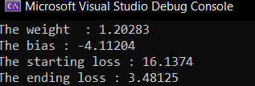

# Linear regression in C++

Linear Regression in C++ from scratch using Intrinsics functions for vectorizing and speeding up the operations

## Dev Environment
Visual studio 2022 

## Classes

The project rely on three main classes:

- `LinearReg` - This class implements the linear regression model, which contains 
    - `loss` for calculating loss every iteration
    - `update` to update weights and bias every iteration
    - `predict` to get the new prediction after update weights
.

- `numcpp` - This class is the main and most important class in the project, it simluates `numpy` in python and do vectorizing too but can say from scratch!!
this class contains many methods to do operations on arrays but "vectorized"
using ` intrinsics` which are bulit-in functions implemented as compiler-specific extensions based on SIMD -single instruction multiple Data- which is used for parallel processing , some of these methods :
    -   `mul`  this method applys element-wise multiplication.
    -   `dot` this method does dot product.
    -   `add` this method  adds  two vectors.
    -   `broadcasting_mul` it broadcasting mul operation with an element which is num
    

- `csv` - This class is used to read csv files (designed for 1 feature ) , return the data as `Data` object which contains `x` vector of input , `y` vector of target , `meta` conatins the meta data and `n` the length of the x

## More information
* Some of the SIMD instructions used in this project
    *    `_mm256_loadu_ps`: load eight single-precision floating-point values from an unaligned memory location into a __m256 register
    * `_mm256_mul_ps` : used to perform element-wise multiplication of two __m256 registers
    * `_mm256_add_ps`sed to perform addition of two __m256 registers
* there is `if-statement` inside every method in numcpp 
    *  __m256 it is data type used for vectorized operations can only load vector of 8 single precision which are (32-bit) "floats" at once
    * when the size of data != any multiple(8) the rest chunks of data must be handled separately as normal instructions.
*  For more information that is ` intrinsics` [documentation](https://learn.microsoft.com/en-us/cpp/intrinsics/x86-intrinsics-list?view=msvc-170)  you can see this too [Vectorization and Parallelization of Loops in C/C++ Code](https://www.jsums.edu/robotics/files/2016/12/FECS17_Proceedings-FEC3555.pdf)
     
## Results 

